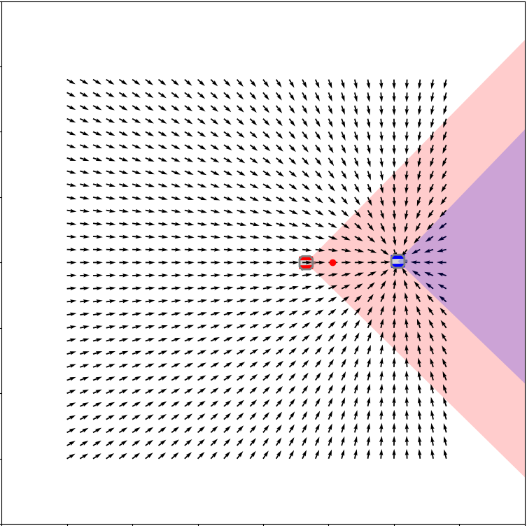

# inFieldOfViewTrajectoryFollowing2D

Little animation which represents a debbin's car following another one. Each time it detects the other one, it will follow it and stay behind. If it goes outside the box, it will turn to go back in. 

# View of the Animation

This project visualizes the animation in an intuitive way. Below is an example of the animation:

